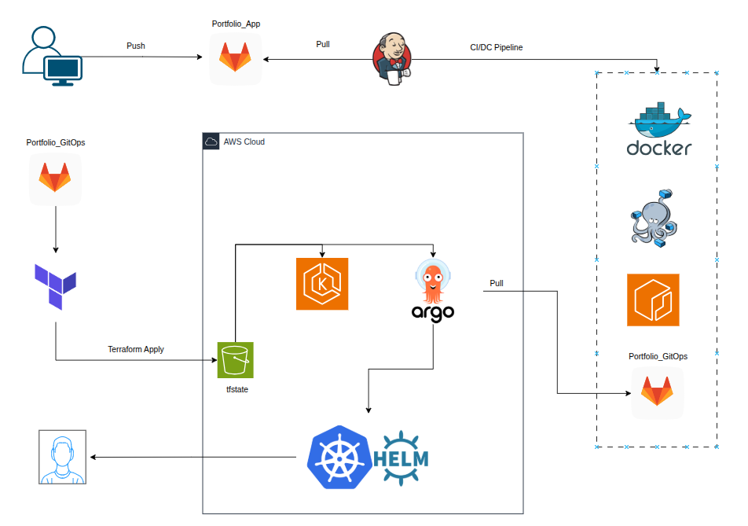

# 📖 DevOps_Portfolio
This project implements a cloud-native application stack designed to mirror production-grade DevOps workflows. A Flask-based REST API backed by PostgreSQL is containerized and deployed onto AWS EKS, with all infrastructure provisioned and managed via Terraform to ensure repeatability and consistency. Application delivery is automated through a Jenkins CI/CD pipeline, incorporating testing, image packaging, and Helm-driven Kubernetes deployments. Observability and reliability are addressed with Fluent Bit for log aggregation and Prometheus + Grafana for metrics collection and visualization. The solution follows AWS best practices for scalability, security, and operational visibility, demonstrating end-to-end DevOps automation across infrastructure, application delivery, and monitoring.

## ⚙️ Architecture



## 📂 Project Overview Structure
```
.
├── overview.png
├── protfilio_app       # Repo for the application and the CI/Cd PipeLine
├── protfilio_gitops    # Repo for Kubernetes & ArgoCD Manifests
├── protfilio_infra     # Repo for Iac 
└── README.md
```
## 🛠️ Tech Stack

- Application: Python (Flask), Docker & Docker Compose

- IaC: Terraform

- CI/CD: Jenkins, Argo CD

- Database: PostgreSQL (Helm)

- Monitoring: Prometheus, Grafana, EFK

- Cloud: AWS (VPC, EC2, ECR, IAM, EKS, Secert Manager, S3)


## 👨‍💻 Author

Yuval Madari – DevOps Engineer 🚀

