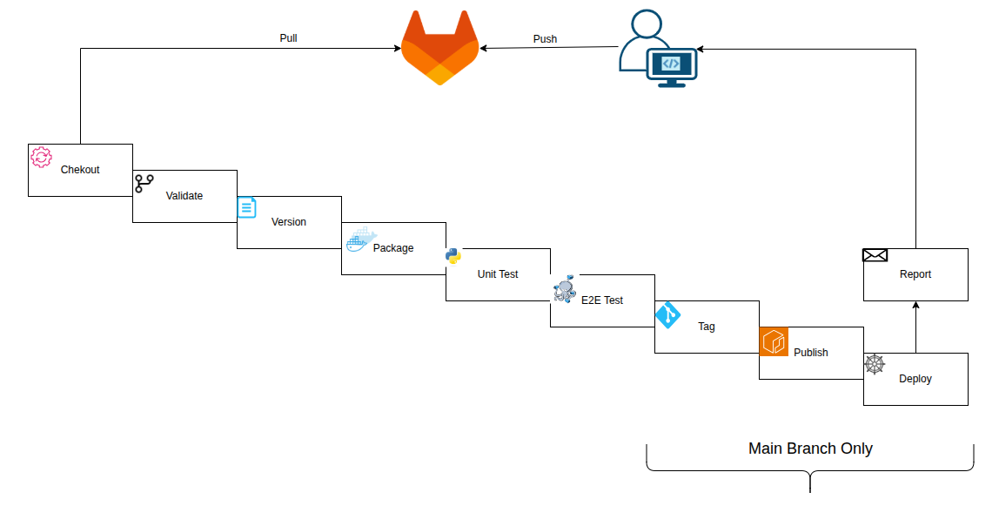
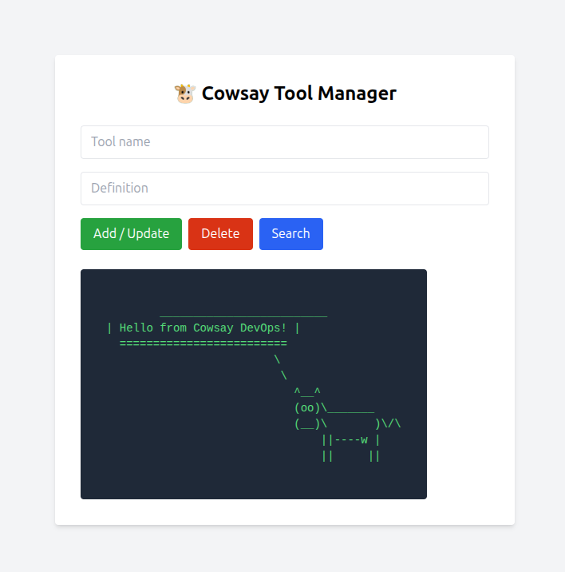

# Application

This repository contains A Flask-based web application that built using Python and Flask, exposing a REST API.
demonstrating modern DevOps practices with automated CI/CD pipeline, containerization, and database integration

# Features
RESTful API built with Flask
PostgreSQL database integration
Automated CI/CD pipeline with Jenkins
Docker containerization
Nginx reverse proxy for static file serving
Comprehensive testing suite (unit and end-to-end tests)


# CI/CD pipeline



# App Demo



## Structure

```text
.
├── Dockerfile              # Dockerfile for building the application's Docker image 
├── Dockerfile.nginx        # Dockerfile for building the Nginx image to serve static files
├── Jenkinsfile             # Jenkins pipeline configuration
├── app                     # Source directory for application code
│   ├── app.py              # Main application file
│   ├── config.py           # Configuration application file to claim the ENV
│   ├── models.py           # Configuration application file to connect the DB
│   ├── requirements.txt    # Python dependencies
│   ├── static              # Directory for static files
│   │   └── script.js       # JS file for styling the application
│   ├── templates           # Directory for HTML templates
│   │   └── index.html      # Main HTML template for the home page
│   └── unit_test.py        # Test file for unit tests
├── docker-compose.yaml     # Docker Compose configuration for local development and testing
├── e2e_test.sh             # 
├── nginx.conf              # Nginx configuration file
└── version.txt             # File for current Version of the Application 
```

## Technology Stack

| Category             | Technologies   |
| -------------------- | -------------- |
| **Containerization** | [Docker]       |
| **CI/CD**            | [Jenkins]      |
| **Application**      | [Flask]        |
| **Database**         | [PostgreSQL]   |


## Prerequisites

Requirements for building and running the project:

- Jenkins Server
- Docker & Docker Compose 

# testing 

1. the docker image contaion the unit test, to run the unit test override the defualt command with python unit_test.py
2. the e2e test is script that check 5 API 

