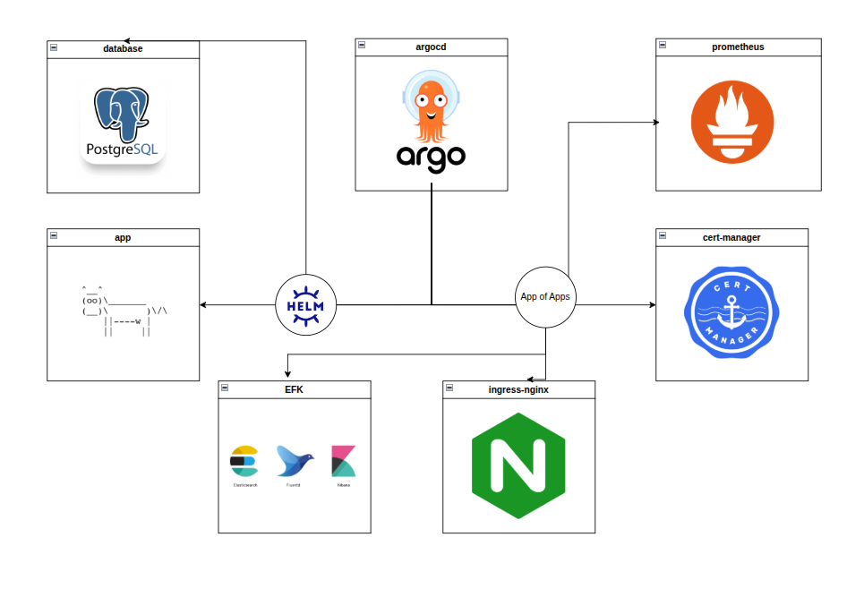

# GitOps 
This repository contains : 
1. helm chart of my appliction
2. app-of-apps that contains the infra app :
    - Cert Manager  
    - Nginx ingress controller
    - Prometheus
    - EFK 

# Argo Cd Demo 



# Kubernetes 


## Structure

```text
.
├── app-of-app.yaml
├── application.yaml                # Directory for the weather application Helm chart
├── cowsay                          # Directory for the weather application Helm chart
│   ├── Chart.yaml                  # Helm chart metadata
│   ├── charts                      # chart Template to contaion all the sub-charts
│   ├── templates                   # chart Template to conraion all my application configuration
│   │   ├── NOTES.txt               # Usueful data for the user  
│   │   ├── _helpers.tpl            
│   │   ├── clusterissuer.yaml      # For certificate issuer 
│   │   ├── deployment.yaml         # application deployment for my app 
│   │   ├── ingress.yaml            # Ingress resource for nginx ingress
│   │   ├── service.yaml            # Seervice For Applicaiton
│   └── values.yaml                 # Values for my application helm chart
├── infra-apps                      # Directory for infrastructure applications
│   ├── cert-manager.yaml           # Cert-Manager configuration
│   ├── elasticsearch               
│   │   ├── elasticsearch.yaml      # Elasticsearch Application
│   │   └── values.yaml             # Elasticsearch Values
│   ├── fluent-bit
│   │   ├── fluent-bit.yaml         # Fluent-bit Application
│   │   └── values.yaml             # Fluent-bit Values
│   ├── ingress-nginx.yaml          # Nginx ingress configuration
│   ├── kibana
│   │   ├── kibana.yaml             # Kibana Application
│   │   └── values.yaml             # Kibana Values
│   └── prometheus.yaml             # Prometheus stack configuration
├── secret.yaml                     # for Prometheus logging
└── service-monitor.yaml            # Monitoring the application
```