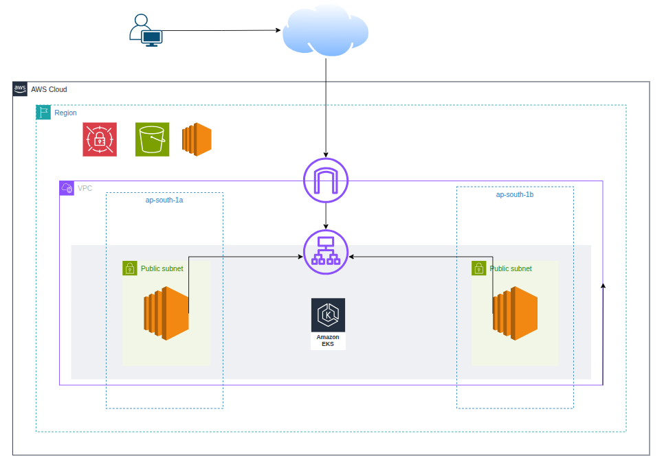

# Infrastructure as Code (IaC) 
This repository contains the Terraform configuration for provisioning and managing AWS cloud infrastructure for the portfolio project. The infrastructure follows best practices for security, scalability, and maintainability.

# AWS 

# Structure 
.
├── main.tf                 # Main Terraform configuration file 
├── modules                 # Module for all resources
│   ├── argocd              # Module for argocd resources
│   │   ├── main.tf         # ArgoCD resources
│   │   └── variables.tf    # Variables file
│   ├── compute             # Module for computing resources
│   │   ├── main.tf         # Compute resources
│   │   ├── output.tf       # Outputs for the module
│   │   └── variables.tf    # Variables file
│   └── network             # Module for network resources
│       ├── main.tf         # Networking resources
│       ├── output.tf       # Outputs for the module
│       └── variables.tf    # Variables file
├── output.tf               # Output to help the user 
├── terraform.tfvars        # Examples for variable values
└── variables.tf            # Definition Variables for the overall infrastructure
